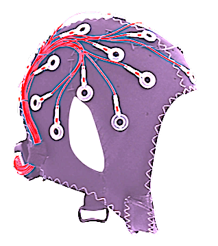

<!--- Source file(s) of this README: -->
<!--- 
Markdown: input: "_readme_blueprint.md" 
JSON: input config: "_readme_blueprint.json" 
JSON: config data: "config_data.json" 
JSON: package: "_readme_package.json" -->
 

  
  <h3 align="center">@renhong-zhang/eeg-emotion-recognition-with-vit</h3>
  

    <b>Use Vision Transformer to generate Emotion Recognition using the DEAP dataset and EEG Signals.</b> 
    This project is built with Tensorflow and PyTorch frameworks to implement EEG-based Emotion recognition. The Wavelet Transform methods DWT, CWT, and DTCWT are used to preprocess the raw EEG signals before inputting them into the ViT model. The emotion recognition test accuracy ranges from 80% to 90% with the abovementioned methods.
          
        <a href="https://github.com/renhong-zhang/eeg-emotion-recognition-with-vit#Demo">View Demo</a>
        ·
        <a href="https://github.com/renhong-zhang/eeg-emotion-recognition-with-vit/issues/new?assignees=-&labels=bug&template=bug_report.yml">Report
          bug</a>
        ·
        <a href="https://github.com/renhong-zhang/eeg-emotion-recognition-with-vit/issues/new?assignees=&labels=feature&template=feature_request.yml">Request
          feature</a>
  

<table border="0" width="100%" id="badge" cellspacing="0" cellpadding="0">
  <tr>
    <td>Prerequisites</td>
    <td></td>
  </tr>
  <tr>
    <td>Languages & Tools</td>
    <td>  </td>
  </tr>
  <tr>
    <td>License</td>
    <td></td>
  </tr>
  <tr>
    <td>State</td>
    <td></td>
  </tr>
</table>



	
<big><b>Table of Contents</big></b>

	<ol>
		<li><a href="#about-the-project">About The Project</a></li>
<ul><li><a href="#tensorflow-version">TensorFlow Version</a></li></ul>
<ul><li><a href="#pytorch-version">PyTorch Version</a></li></ul>
<ul><li><a href="#data-processing">Data Processing</a></li></ul>
<ul><li><a href="#built-with">Built With</a></li></ul>
<li><a href="#getting-started">Getting Started</a></li>
<ul><li><a href="#prerequisites">Prerequisites</a></li></ul>
<ul><li><a href="#installation">Installation</a></li></ul>
<li><a href="#usage">Usage</a></li>
<li><a href="#roadmap">Roadmap</a></li>
<li><a href="#author-">Author </a></li>
<li><a href="#how-can-i-support-you">How can I support you?</a></li>
<li><a href="#acknowledgments">Acknowledgments</a></li>
<li><a href="#license">License</a></li>
	</ol>

## About The Project

### TensorFlow Version

This code replicates the methodology described in the paper "[Introducing attention mechanism for eeg signals: Emotion recognition with vision transformers](https://ieeexplore.ieee.org/document/9629837)" and provides empirical support for the proposed approach. This code is based on TensorFlow and improves and corrects numerous issues of the paper's code. The authors claim a 99.4% (Valence) and 99.1%(Arouse) accuracy for their original data runs, but even this still needs to be tested in practice. The actual test accuracy is at most 81%, and the CWT never reaches 97%(Valence) and 95.75%(Arouse) and is just over 60%. I emailed the author, Arjun, three months ago, and all I got back was a promise that he would update his program. For this reason, I am skeptical about their paper's results.
After reading the program carefully, I found that their approach still has many inappropriate things.
I tested various Wavelet Transform methods(DTCWT, DWT, and CWT), and my heavily modified model can then process EEG data for emotion recognition. All these tests have achieved test accuracy of 80% or higher, with the best reaching 85%.

### PyTorch Version

This portion of the program is based on "[lucidrains/vit-pytorch](https://github.com/lucidrains/vit-pytorch)" and has re-implemented the same model as the TensorFlow Version. As a result, the program is clearer, more concise, and more aesthetically pleasing.

### Data Processing

This directory contains DEAP Matlab data for the CWT, DTCWT, and DWT pre-processing program, including PSD, DE, MAE, DFA, etc., in the δ, γ, β, α and θ bands, with all functions included in `Processing_mat_xwt.PY`, `Processing_xwt.py`. Also included are three Matlab programs: `processing_CWT.m` (only this Matlab file is modified from "[Introducing attention mechanism for eeg signals: Emotion recognition with vision transformers](https://ieeexplore.ieee.org/document/9629837)"), `processing_DTCWT.py`, and `processing_DWT.py` (these two are written by myself).
The next stage is to research translating EEG signals into human-understandable text, image, or video.

### Built With

<table border="0" width="100%" id="badge" cellspacing="0" cellpadding="0">
  <tr>
    <td><b>Major Frameworks/Libraries</b></td>
    <td>
       
    </td>
  </tr>
</table>

## Getting Started

### Prerequisites

`python3.8` or above.

### Installation

1. For **Ternsorflow Version**: Install `tensorflow-gpu`
2. For **PyTorch Version**: Install `PyTorch-cudnn`
3. Install all the relavent Libraries

## Usage

1. run `Processing_mat_xwt.py`,
2. run `Processing_xwt.py`,
3. run `Runner.py`. 

## Roadmap

- [ ] The next stage is to research translating EEG signals into human-understandable text, image, or video.

## Author 

<table border="0" width="100%" style="margin: 0px;" id="badge" cellspacing="0">
    <tr>
        <td width="20%">
            
        </td>
        <td><big><b>Renhong Zhang</b></big>
             
            Github: <a href="https://github.com/renhong-zhang">@renhong-zhang</a>
        </td>
    </tr>
</table>

## How can I support you?

There are lots of ways to support me! I would be so happy if you give this repository a ⭐️ and tell your friends about this little corner of the Internet.

## Acknowledgments

* [AniketRajpoot/Emotion-Recognition-Transformers: SOTA methods for performing emotion classification using Transformers.](https://github.com/AniketRajpoot/Emotion-Recognition-Transformers): Arjun, Arjun, Aniket Singh Rajpoot, and Mahesh Raveendranatha Panicker. "Introducing attention mechanism for eeg signals: Emotion recognition with vision transformers." 2021 43rd Annual International Conference of the IEEE Engineering in Medicine & Biology Society (EMBC). IEEE, 2021.
* [lucidrains/vit-pytorch: Implementation of Vision Transformer, a simple way to achieve SOTA in vision classification with only a single transformer encoder, in Pytorch](https://github.com/lucidrains/vit-pytorch): The Pytorch Version is based on this ViT project

## License

[MIT](https://opensource.org/licenses/MIT)

Copyright © 2022-present, Renhong Zhang
